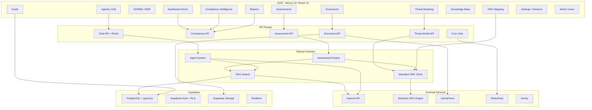

# Feature Specification: ihOS — Compliance Intelligence Platform

**Feature Branch**: `main`

**Created**: 2026-06-29

**Status**: Draft (v3 — two operating moments formalized, 2026-07-07)

**Input**: User description: "Spec completa do ihOS como produto (visão geral de todos os módulos)"

---

## Product Vision

**ihOS** (Ionic Health OS) is a multi-framework GRC Compliance Intelligence Platform built for **Ionic Health** to manage regulatory compliance for **nCommand Lite** — a SaaS medical device for remote MRI/CT/PET-CT operation via WebRTC.

The platform unifies **RAG-powered evidence evaluation**, **automated threat modeling (STRIDE + FMEA)**, **agentic AI compliance assistant**, and **multi-framework compliance assessments** across 231 frameworks (ISO 27001, HIPAA, LGPD, SOC 2, NIST 800-53, TX-RAMP, GDPR, IEC 62304) into a single dashboard with real-time gap analysis, POA&M tracking, and remediation goal management.

---

## Operating Model — The Two Moments *(normative, v3)*

The platform operates in **two distinct moments**. They answer different questions,
move at different cadences, and must never overwrite each other — every posture
surface presents them side by side.

### Moment 1 — Documental (always document-grounded)

Gap analysis against any standard/framework. **Every analysis** — framework
posture, answering a customer assessment, or generating a threat model — MUST
resolve its document set through three mandatory context variables:

1. **Global corpus**: ISMS/PIMS policies, procedures and organization-wide
   documents. Applies to every analysis.
2. **Commercial context (sales channel)**: when Ionic sells **through GEHC**,
   Ionic's privacy role is DIFFERENT from when it sells **direct**. This is
   not merely a document filter — the role changes which privacy obligations
   apply (controller vs. processor; ISO 27701 Annex A vs. Annex B; LGPD
   controlador vs. operador). Channel context therefore selects both the
   contractual documents (DPAs, MSAs, EULAs) AND the applicable control
   subset. Analyses must never mix channel overlays, and "all channels" is
   restricted to internal aggregate views that never produce a
   customer-facing answer.
3. **Product version**: nCommand Lite versions carry different control
   realities in their documentation (SAD/SRS/test reports). Each version is
   analyzed separately; version-scoped documents never answer for another
   version. Version lineage (previous_version_id) supports inheritance-aware
   threat modeling.

### Moment 2 — Continuous Observation (Ionic SI view, dynamic)

The security team's live view over the same SCF control spine, fed by
operational security tooling.

**Normative rule: DefectDojo is the single heart of ALL vulnerabilities.**
Every vulnerability, from every source, lands in DefectDojo first; ihOS
integrates with DefectDojo only (one pipe, many feeds). Planned/actual feeds:

| Feed | Status |
|---|---|
| CI/CD pipeline scans (SAST/DAST/SCA) | ✅ already flowing into DefectDojo |
| Pentest results (imported reports) | ⏳ to be aggregated |
| External surface scan of every `ionic.health` asset/URL (SecurityScorecard-like) | ⏳ to be aggregated |
| Wazuh findings across all company assets (desktops to firewalls) | 🚧 in deployment |

ihOS syncs DefectDojo findings, resolves them onto SCF controls
(`runtime_control_signals`), and derives an observed status per control
(`violated` / `degraded` / `clean`).

**Separation-of-views rule (normative, 2026-07-08).** Documental
calculations and their outputs — customer assessments and their answers,
threat models and their reports, SCF gap analysis / framework scorecards —
use DOCUMENTS ONLY. DefectDojo/observation data never enters them. The
observed view (DefectDojo findings, plus ISMS/PIMS weaknesses lacking
operational evidence) is the SI team's OPERATIONAL surface: internal-role
gated, served by dedicated endpoints (dashboard observed-posture; on-demand
threat-correlation reads), and never shared into document-based answers or
results. The only permitted cross-moment interaction is a TRIGGER: a control
documentally conforming but observed violated invalidates its cached
evaluation (forcing a documents-only re-evaluation) and alerts the SI team —
observation may prompt documental work, never inform its result. A
second-phase spec will define the mandatory routing of all vulnerability
sources into DefectDojo.

### Architecture

| Stack | Technology | Responsibility |
|-------|-----------|----------------|
| **ihOS** (Frontend) | Next.js 16, React 19, TypeScript 5, Tailwind CSS 4 | Dashboard, Auth, Orchestration, Agentic AI, Persistence |
| **ihos-api** (Backend) | FastAPI + Python | RAG Search, Threat Model Pipeline, ETL |
| **ionic-txramp** (CLI) | Python scripts | Document ingestion, offline search, gap analysis, report generation |
| **Standard GRC Engine** | External API (standard-api.bekaa.eu) | 1,468 SCF controls, 231 frameworks, 10 AI endpoints |
| **Supabase** | PostgreSQL + pgvector + Auth + Storage + Realtime | Database, Auth, Vector Search, File Storage, Live Updates |

---

## User Scenarios & Testing *(mandatory)*

### User Story 1 — Run a Compliance Assessment (Priority: P1)

A compliance officer evaluates nCommand Lite against one or more regulatory frameworks to determine current compliance posture.

**Why this priority**: Core value proposition — without assessments, the platform has no purpose.

**Independent Test**: Select frameworks, run assessment, receive scored report with per-control evaluations.

**Acceptance Scenarios**:

1. **Given** the officer is on the Assessments page, **When** they click "New Assessment" and select ISO 27001 + HIPAA in quick mode, **Then** the system evaluates all mapped controls via RAG search and returns a scored report within 60 seconds.
2. **Given** the assessment completes, **When** the officer views the detail page, **Then** they see a 4-step stepper: Overview -> Control Analysis -> Gaps & Remediation -> Export.
3. **Given** a control evaluation fails (API timeout), **Then** the failed control shows `[EVALUATION_ERROR]` status, not silently non-compliant.

---

### User Story 2 — Dual-Phase Compliance Evaluation (Priority: P1)

The officer distinguishes between **ISMS policy documentation** (Phase 1) and **operational evidence of implementation** (Phase 2) for each control.

**Why this priority**: ISO 27001 auditors require proof that both policies AND operational evidence exist.

**Independent Test**: Run deep-mode assessment and verify each control shows ISMS and Evidence phases separately.

**Acceptance Scenarios**:

1. **Given** a deep-mode assessment, **When** control A.5.1 is evaluated, **Then** two RAG searches run: one against `ISMS_CORE` and one against `OPERATIONAL`.
2. **Given** ISMS found but no evidence, **Then** status is `partial` (amber). Both found = `conforming` (green). Neither = `gap` (red). Evidence only = `informal` (blue).

---

### User Story 3 — STRIDE Threat Modeling with FMEA (Priority: P1)

A security architect generates a structured threat model for nCommand Lite components, with STRIDE threats correlated to FMEA severity ratings.

**Why this priority**: Prerequisite for ISO 27001 risk assessment (Clause 6.1.2) and FDA 510(k) submissions.

**Independent Test**: Create a threat model, verify STRIDE analysis with FMEA correlations and risk matrix.

**Acceptance Scenarios**:

1. **Given** the architect opens Threat Modeling, **When** they generate a model for the WebRTC component, **Then** a 5-step stepper renders: Scope -> Assets -> STRIDE Analysis -> Risk Matrix -> Recommendations.
2. **Given** a STRIDE threat is identified, **Then** FMEA shows Severity, Occurrence, and Detection ratings.
3. **Given** the model is complete, **Then** it supports draft/reviewed/approved workflow with radar charts and risk matrix visualization.

---

### User Story 4 — Document Ingestion & RAG Indexing (Priority: P1)

The admin ingests compliance documents into the knowledge base for RAG-powered search.

**Why this priority**: Without document corpus, all RAG-dependent features return empty results.

**Independent Test**: Upload a PDF via Document Management, verify it appears in RAG search results within 5 minutes.

**Acceptance Scenarios**:

1. **Given** admin uploads documents, **Then** the Clarity Gate validates document quality before indexing.
2. **Given** the ETL pipeline runs, **Then** documents are parsed (LlamaParse), chunked (1200 chars/250 overlap), translated (PT->EN), embedded (text-embedding-3-small 1536-dim), and stored with HNSW indexes.
3. **Given** a duplicate document, **Then** SHA-256 deduplication prevents re-processing.

---

### User Story 5 — RAG Hybrid Search (Priority: P1)

The assessment engine or user searches the document corpus using natural language or control IDs.

**Why this priority**: Foundation for assessments, threat models, and chat queries.

**Independent Test**: Query "access control policy" and verify relevant chunks returned from multiple categories.

**Acceptance Scenarios**:

1. **Given** a query, **Then** 4 channels run in parallel: Vector (cosine), BM25 (keyword), SCF Graph (control ID), Direct Match, fused via Reciprocal Rank Fusion.
2. **Given** RRF results, **Then** GPT-4o-mini cross-encoder reranks top-20, returns top-10.
3. **Given** a control ID query (e.g., "AC-7"), **Then** SCF Graph Resolver expands to all cross-framework mappings.

---

### User Story 6 — Agentic Compliance Chat (Priority: P1)

An analyst asks natural-language compliance questions and gets answers grounded in the document corpus, with ReAct agent loops.

**Why this priority**: Not all queries fit structured assessments — ad-hoc questions with file upload and questionnaire auto-answering are essential.

**Independent Test**: Ask a compliance question, get a grounded answer with source citations and tool usage trace.

**Acceptance Scenarios**:

1. **Given** the analyst opens Chat, **When** they ask a compliance question, **Then** the Vercel AI SDK (useChat) triggers a ReAct loop with RAG tool calls.
2. **Given** a XLSX/CSV/PDF file is uploaded, **Then** the system parses questionnaires, auto-answers questions from the knowledge base, and presents for review.
3. **Given** a conversation history, **When** the analyst returns, **Then** previous conversations are listed with resumable state.
4. **Given** suggestion chips are displayed, **Then** clicking one triggers a pre-defined compliance query.

---

### User Story 7 — Compliance Intelligence Dashboard (Priority: P2)

The CISO gets a single-pane-of-glass view of compliance posture, evidence coverage, gaps, and ROI-prioritized remediation.

**Why this priority**: Executive decision-making requires aggregated, real-time views.

**Independent Test**: View the Compliance page and verify scorecard, evidence summary, gap table, and ROI path.

**Acceptance Scenarios**:

1. **Given** 3+ assessments completed, **When** the CISO opens Compliance Intelligence, **Then** they see: ComplianceScorecard, EvidenceSummary, GapTable, RoiPriority widgets with real-time refresh.
2. **Given** a framework score drops below 70%, **Then** a red warning indicator with critical gap count appears.
3. **Given** RealtimeRefresher is active, **Then** scores update live as assessments complete.

---

### User Story 8 — SCRMS (MSR) Security Baselines (Priority: P2)

The security engineer manages MSR baselines with MCR (Minimum Compliance Requirement) and DSR (Discretionary Security Requirement) controls, filtered by PPTDF scope.

**Why this priority**: MSR baselines map directly to product version compliance requirements for TX-RAMP and internal security standards.

**Independent Test**: View SCRMS page, filter by PPTDF scope, verify MCR/DSR controls are listed.

**Acceptance Scenarios**:

1. **Given** the engineer opens SCRMS, **Then** MSR baselines are loaded from `msr_baselines` + `msr_controls` with PPTDF scope filtering.
2. **Given** a product version is selected, **Then** version-specific deltas from `product_version_deltas` are applied.

---

### User Story 9 — Cross-Framework GRC Mapping (Priority: P2)

The compliance analyst explores how controls map across frameworks (SCF -> ISO 27001 -> NIST -> HIPAA -> TX-RAMP).

**Why this priority**: 1,468 SCF controls provide the unifying meta-layer. Proving compliance with one framework provides evidence for others.

**Independent Test**: Search for "A.8.1" and see all cross-framework mappings with sync status.

**Acceptance Scenarios**:

1. **Given** the analyst opens GRC Mapping, **Then** SCF controls joined with `scf_framework_mappings` show all cross-framework links.
2. **Given** a "Sync from GRC API" button is clicked, **Then** the Standard GRC Engine API is called and mappings are updated.

---

### User Story 10 — Gap Analysis & POA&M (Priority: P2)

The officer identifies non-conforming controls and tracks remediation via Plan of Action & Milestones.

**Why this priority**: Regulatory auditors require documented POA&M (ISO, TX-RAMP, FedRAMP).

**Independent Test**: After assessment with gaps, view POA&M items with status tracking.

**Acceptance Scenarios**:

1. **Given** an assessment has gaps, **When** the Gaps tab is opened, **Then** each gap shows missing phase, recommended action, and priority.
2. **Given** POA&M items exist, **Then** they support `open`, `in_progress`, `closed`, `risk_accepted` statuses.

---

### User Story 11 — GRC Remediation Goals & Tasks (Priority: P2)

The compliance officer creates remediation goals per framework, breaks them into tasks, and tracks progress.

**Why this priority**: Structured goal tracking converts gap findings into actionable work items.

**Independent Test**: Create a goal for ISO 27001, add 5 tasks, track progress percentage.

**Acceptance Scenarios**:

1. **Given** the officer opens Goals, **When** they create a goal for "ISO 27001 Gap Remediation", **Then** it's persisted to `agent_goals` with framework linkage.
2. **Given** tasks are added to the goal, **Then** progress percentage updates as tasks are completed.
3. **Given** filter by framework/status, **Then** goals are filtered accordingly.

---

### User Story 12 — Reports Generation & Export (Priority: P2)

The officer generates compliance reports (PDF/Excel) for regulatory submissions.

**Why this priority**: Auditors require formatted reports, not dashboard screenshots.

**Independent Test**: Generate a PDF report for ISO 27001 and verify it contains all assessment data.

**Acceptance Scenarios**:

1. **Given** the officer opens Reports, **When** they click "Generate" for a framework, **Then** a PDF/Excel report is generated via `/api/compliance/report`.
2. **Given** reports are listed, **Then** each shows generation date, framework, and download link.

---

### User Story 13 — Document Management with Clarity Gate (Priority: P2)

The officer uploads compliance documents with AI-powered quality validation before they enter the knowledge base.

**Why this priority**: Poor quality documents pollute RAG search — Clarity Gate ensures document fitness.

**Independent Test**: Upload a low-quality PDF and verify Clarity Gate rejects it with feedback.

**Acceptance Scenarios**:

1. **Given** the officer opens Documents, **Then** tabs show All / Global ISMS / nCommand Lite / Sales Channels.
2. **Given** a PDF is uploaded via UploadWizard, **Then** the Clarity Gate (`/api/documents/validate-clarity/`) validates quality before indexing.
3. **Given** a document passes validation, **Then** it's stored in Supabase Storage and chunks are indexed for RAG.

---

### User Story 14 — Product Version Management (Priority: P3)

The regulatory manager tracks assessments per product version with ISMS baselines and version deltas.

**Why this priority**: FDA and ISO audits are version-specific.

**Independent Test**: Create version 2.3.0, run scoped assessment, verify separation from v2.2.1.

**Acceptance Scenarios**:

1. **Given** the manager creates a product version, **Then** ISMS baselines and controls are versioned.
2. **Given** version context is switched via VersionSwitcher, **Then** all dashboard data filters by selected version.

---

### User Story 15 — Sales Channel Compliance Overlay (Priority: P3)

Assess compliance with channel-specific requirements (e.g., B2B_GEHC has PDPA and EULA requirements).

**Why this priority**: Different channels impose additional contractual compliance requirements.

**Independent Test**: Run assessment with `B2B_GEHC` channel, verify GEHC-specific evidence is included.

**Acceptance Scenarios**:

1. **Given** "B2B GEHC" is selected, **Then** RAG search includes `b2b_overlays/GEHC/` documents.

---

### User Story 16 — Admin User Management (Priority: P3)

Admin approves/rejects user signup requests with role-based access control.

**Why this priority**: RBAC is required for compliance platforms handling sensitive data.

**Independent Test**: New user signs up, admin approves, user gains access.

**Acceptance Scenarios**:

1. **Given** a new user signs up, **Then** their status is `pending` and they see the Pending Approval page.
2. **Given** admin opens Admin Users, **Then** they can approve/reject with role assignment (admin/ionic_user/client_user).

---

### User Story 17 — Knowledge Base Health Dashboard (Priority: P3)

The admin monitors RAG corpus health: document count, chunk count, missing indexes, ISO coverage.

**Why this priority**: Ensures the knowledge base is complete and healthy for accurate assessments.

**Independent Test**: View Knowledge Base and verify metrics match actual database counts.

**Acceptance Scenarios**:

1. **Given** admin opens Knowledge Base, **Then** they see: document count, chunk count, missing index count, ISO coverage percentage.

---

### User Story 18 — External Integrations (Priority: P3)

The system integrates with DefectDojo for vulnerability findings and Composio for workflow automation.

**Why this priority**: Enterprise compliance requires integration with existing security tooling.

**Independent Test**: Verify DefectDojo sync cron imports findings into `defectdojo_findings`.

**Acceptance Scenarios**:

1. **Given** DefectDojo sync cron runs, **Then** vulnerability findings are imported and mapped to compliance controls.
2. **Given** a Composio webhook fires, **Then** the notification router dispatches to configured channels (Teams, email, in-app).

---

### Edge Cases

- RAG returns 0 results -> Control marked `gap` with "No evidence found".
- OpenAI API down -> Control marked `[EVALUATION_ERROR]`, assessment continues.
- Document >100 pages -> LlamaParse agentic tier handles; pdfplumber fallback.
- Simultaneous assessments -> Each gets unique `trace_id`.
- Vercel 5-min timeout -> Batch processing with `Promise.all`; MAX_PAGES=20 guard.
- Supabase RLS blocks query -> `createAdminClient()` for server-side; client queries respect user scoping.
- User not approved -> Redirected to `/pending-approval` page.
- Rate limit exceeded -> Upstash Redis rate limiter returns 429 via middleware.

---

## Requirements *(mandatory)*

### Functional Requirements

**Core Assessment Engine**
- **FR-001**: Evaluate controls against 10+ frameworks via RAG-powered evidence matching.
- **FR-002**: Support dual-phase evaluation: ISMS Policy + Operational Evidence.
- **FR-003**: Produce 4 combined statuses: `conforming`, `partial`, `informal`, `gap`.
- **FR-004**: Mark API failures as `[EVALUATION_ERROR]`.
- **FR-005**: Persist all evidence evaluations with `trace_id` linking.

**RAG Search**
- **FR-006**: 4-channel hybrid search: Vector, BM25, SCF Graph, Direct Match + RRF.
- **FR-007**: GPT-4o-mini cross-encoder reranking.
- **FR-008**: Resolve control IDs to SCF-mapped codes across all frameworks.

**Threat Modeling**
- **FR-009**: STRIDE threat model generation with 5-step pipeline.
- **FR-010**: FMEA severity/occurrence/detection correlation.
- **FR-011**: Draft/reviewed/approved workflow with risk matrix and radar charts.

**ETL Pipeline**
- **FR-012**: Ingest PDF, DOCX, XLSX, CSV, HTML, TXT, MD files.
- **FR-013**: Translate PT->EN with compliance terminology via GPT-4o-mini.
- **FR-014**: Auto-tag with NIST control families and ISO references.
- **FR-015**: SHA-256 deduplication.

**Agentic AI**
- **FR-016**: ReAct agent loops via Vercel AI SDK with tool_calls audit trail.
- **FR-017**: Intent routing to appropriate agent tools via intent-router.
- **FR-018**: Questionnaire parsing, auto-answering, and human review workflow.
- **FR-019**: Dynamic org state management for agent context.
- **FR-020**: Agent autonomy boundaries (green/yellow/red zones).
- **FR-021**: Agent learning corrections from user feedback.

**Dashboard & UI**
- **FR-022**: Real-time compliance scorecard with Supabase Realtime.
- **FR-023**: Card-based stepper pattern for all multi-step workflows.
- **FR-024**: PDF and CSV export for assessments, threat models, and reports.
- **FR-025**: Contextual help system with help sidebar and tooltips.
- **FR-026**: Onboarding wizard for new users.

**Auth & Security**
- **FR-027**: Supabase Auth with RLS on all 30+ tables.
- **FR-028**: RBAC with 3 roles: admin, ionic_user, client_user.
- **FR-029**: User approval workflow (pending/approved/rejected).
- **FR-030**: Rate limiting via Upstash Redis in middleware.
- **FR-031**: `createAdminClient()` for server-side elevated operations.

**Framework Management**
- **FR-032**: Canonical `framework-registry.ts` with aliases.
- **FR-033**: Standard GRC API sync for 1,468 SCF controls / 231 frameworks.

**Integrations**
- **FR-034**: DefectDojo vulnerability finding import and control mapping.
- **FR-035**: Composio webhook integration for workflow automation.
- **FR-036**: Multi-channel notifications (Teams, email, in-app).
- **FR-037**: Sentry error tracking and monitoring.

### Key Entities

- **Assessment**: Point-in-time compliance evaluation against 1+ frameworks.
- **Evidence Evaluation**: Per-control result with compliance status, confidence, dual-phase data.
- **Threat Model**: STRIDE analysis with FMEA correlations, draft/reviewed/approved lifecycle.
- **Document / Chunk**: Compliance document with vectorized chunks (1536-dim, HNSW indexed).
- **SCF Control**: Secure Controls Framework control (1,468 controls, 33 domains).
- **Intelligence Snapshot**: Historical compliance score for trend analysis.
- **Product Version**: nCommand Lite release with ISMS baselines and deltas.
- **MSR Baseline / Controls**: Security baselines with MCR/DSR and PPTDF scope.
- **POA&M Item**: Plan of Action & Milestones finding with remediation tracking.
- **Agent Goal / Task**: GRC remediation projects broken into executable tasks.
- **Conversation / Message**: Chat conversation with tool_calls audit trail.
- **Profile**: User profile with RBAC role and approval status.

---

## Success Criteria *(mandatory)*

### Measurable Outcomes

- **SC-001**: Quick-mode assessment of 6 frameworks completes in under 90 seconds.
- **SC-002**: Deep-mode dual-phase assessment completes within 5-minute Vercel limit.
- **SC-003**: RAG search returns relevant results (cosine >= 0.7) for 95%+ of control queries.
- **SC-004**: Threat models produce >=1 threat per STRIDE category for non-trivial components.
- **SC-005**: System handles 6,400+ chunks without search latency exceeding 3 seconds.
- **SC-006**: 100% of assessment results traceable to source chunks via `chunk_id`.
- **SC-007**: Cross-framework SCF mappings cover all 10 primary frameworks with >=80% control coverage.
- **SC-008**: Zero false negatives on `[EVALUATION_ERROR]`.
- **SC-009**: Clarity Gate rejects documents with quality score below threshold.
- **SC-010**: Agent chat responses cite source documents with chunk-level precision.

---

## Assumptions

- Users have stable internet (Vercel + Supabase are cloud-hosted).
- Document corpus is primarily Portuguese and English; other languages not supported in v1.
- nCommand Lite is the primary product; single-tenant in v1.
- OpenAI API access is funded (GPT-4o for chat, GPT-4o-mini for embeddings/reranking).
- Supabase has pgvector + HNSW indexing enabled.
- LlamaParse agentic tier is available; pdfplumber is fallback.
- SCF mapping database (1,468 controls) is pre-loaded.
- Mobile support out of scope for v1 — desktop-first dark-mode UI.
- Real-time collaboration out of scope for v1.
- Standard GRC API (standard-api.bekaa.eu) is available and funded.
- DefectDojo instance is pre-configured for vulnerability sync.

---

## Module Architecture

### Module Map

### Module Inventory (13 Dashboard + 12 API Groups)

| # | Module | Path | Lines | Status |
|---|--------|------|-------|--------|
| 1 | Dashboard Home | `(dashboard)/page.tsx` | 447 | Functional |
| 2 | Compliance Intelligence | `(dashboard)/compliance/page.tsx` | 140 | Functional |
| 3 | SCRMS (MSR) | `(dashboard)/compliance/scrms/page.tsx` | 779 | Functional |
| 4 | GRC Mapping | `(dashboard)/compliance/mappings/page.tsx` | 407 | Functional |
| 5 | Threat Modeling | `(dashboard)/threat-modeling/` | 318 + 35K detail | Functional |
| 6 | Agentic Chat | `(dashboard)/chat/` | 507 + conversation | Functional |
| 7 | Assessments | `(dashboard)/assessments/` | 869 + 750 detail | Re-engineered |
| 8 | Documents | `(dashboard)/documents/page.tsx` | 211 | Functional |
| 9 | Goals | `(dashboard)/goals/page.tsx` | 708 | Functional |
| 10 | Knowledge Base | `(dashboard)/knowledge-base/page.tsx` | 72 | Functional |
| 11 | Reports | `(dashboard)/reports/page.tsx` | 207 | Functional |
| 12 | Settings + Versions | `(dashboard)/settings/` | 302 + versions | Functional |
| 13 | Admin Users | `(dashboard)/admin/users/page.tsx` | 58 | Functional (admin-only) |

### Supabase Tables (30+)

| Category | Tables | Purpose |
|----------|--------|---------|
| **Core** | profiles, conversations, messages, compliance_documents, document_chunks, scf_controls, scf_framework_mappings | Users, Chat, Documents, Controls |
| **Compliance** | compliance_assessments, poam_items, evidence_evaluations, intelligence_snapshots | Assessments, POA&M, Evidence, Snapshots |
| **Agentic** | agent_goals, agent_tasks, agent_notifications, agent_learning_corrections, agent_autonomy_boundaries, agent_org_state | AI Agent System |
| **Product** | product_versions, isms_baselines, isms_controls, product_version_deltas, msr_baselines, msr_controls | Version Management |
| **Integrations** | integration_connections, notification_channels, defectdojo_findings, integration_sync_log, threat_models | External Systems |

### Component Library (40+ components)

| Group | Count | Components |
|-------|-------|------------|
| UI Base | 6 | badge, button, card, dialog, input, progress |
| Dashboard | 14 | scorecard, evidence-summary, gap-table, roi-priority, stats-card, activity-feed, goals-widget, help-sidebar, notifications, realtime-refresher, version-switcher, vulnerability-posture, page-title, help-tooltip |
| Chat | 4 | conversation-list, message-bubble, questionnaire-review, suggestion-chips |
| Documents | 3 | ClarityReport, DocumentTable, UploadWizard |
| Risk/Threat | 9 | fmea-table, generate-modal, review-panel, risk-matrix, risk-summary-cards, stride-radar, threat-model-card, threat-table |
| Assessments | 2 | evidence-table, run-assessment-modal |
| Onboarding | 2 | onboarding-gate, onboarding-wizard |
| Providers | 1 | query-provider |
