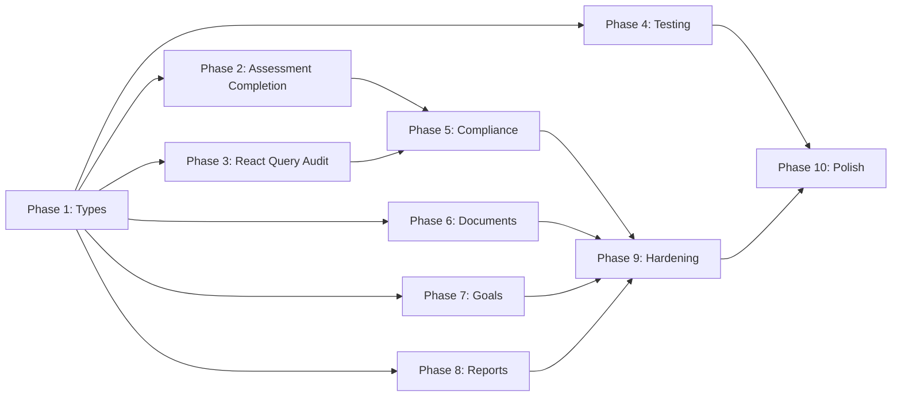

# Tasks: ihOS — Compliance Intelligence Platform

**Input**: Design documents from `.specify/memory/`

**Prerequisites**: plan.md (done), spec.md (done), constitution.md (done)

**Tests**: Included where critical for regression prevention.

**Organization**: Tasks grouped by work stream from plan.md, mapped to user stories.

## Format: `[ID] [P?] [Story] Description`

- **[P]**: Can run in parallel (different files, no dependencies)
- **[Story]**: Which user story this task belongs to
- Include exact file paths in descriptions

---

## Phase 1: Foundation — Supabase Type Regeneration (BLOCKING)

**Purpose**: Eliminate 215 `'never'` TypeScript errors that affect all modules. MUST be done first.

**⚠️ CRITICAL**: All other work benefits from correct types.

- [ ] T001 [US-ALL] Run `supabase gen types typescript --project-id <id>` to regenerate `src/lib/supabase/types.ts`
- [ ] T002 [US-ALL] Verify `npx tsc --noEmit` error count drops from 215 to near-zero
- [ ] T003 [US-ALL] Fix any remaining type errors caused by schema mismatches in code
- [ ] T004 [US-ALL] Fix Dashboard Home reference to `compliance_assessments` table (same bug as assessment detail)

**Checkpoint**: TypeScript compiles with 0 errors. All Supabase queries have correct types.

---

## Phase 2: Assessment Engine Completion — US1, US2 (Priority: P1) 🎯

**Goal**: Complete the deferred items from the Assessment Engine re-engineering.

**Independent Test**: Assessments listing page uses React Query, renders extracted components, passes typecheck.

### Implementation

- [ ] T005 [US1] Migrate `src/app/(dashboard)/assessments/page.tsx` to use `useAssessments()` hook from `src/hooks/queries/use-assessments.ts`
  - Replace raw Supabase `from('assessments').select('*')` with `useAssessments(productVersionId)`
  - Replace raw Supabase `from('scf_framework_mappings').select(...)` with a new `useFrameworkMappings()` hook
- [ ] T006 [US1] Replace inline `RunAssessmentModal` in `page.tsx` with import from `src/components/assessments/run-assessment-modal.tsx`
- [ ] T007 [US1] Replace inline evidence table in `page.tsx` with import from `src/components/assessments/evidence-table.tsx`
- [ ] T008 [US1] Update `RunAssessmentModal` to use `useRunAssessment()` mutation hook instead of inline `fetch('/api/assessments/run')`
- [ ] T009 [US2] Extract ISO 27001 Annex A controls from `src/lib/assessment/engine.ts` hardcoded array to `src/lib/assessment/data/iso27001-annex-a.json`
- [ ] T010 [P] [US2] Parallelize `src/lib/assessment/local-engine.ts` evaluation loop using `Promise.all` batches of 5

**Checkpoint**: Assessments listing page is <400 lines, uses React Query, renders extracted components. ISO 27001 controls are in a JSON file.

---

## Phase 3: React Query Migration Audit — US1-US18 (Priority: P1)

**Goal**: Ensure all pages comply with Constitution Principle IV (React Query for Server State).

**Independent Test**: No page component has raw `useEffect` + `fetch` + `useState` for data loading.

- [ ] T011 [US7] Audit `src/app/(dashboard)/compliance/page.tsx` — currently Server Component, OK (no migration needed)
- [ ] T012 [US8] Audit `src/app/(dashboard)/compliance/scrms/page.tsx` (779 lines) — check for raw Supabase calls
- [ ] T013 [US9] Audit `src/app/(dashboard)/compliance/mappings/page.tsx` (407 lines) — check for raw Supabase calls
- [ ] T014 [US11] Audit `src/app/(dashboard)/goals/page.tsx` (708 lines) — check for raw Supabase calls
- [ ] T015 [US13] Audit `src/app/(dashboard)/documents/page.tsx` (211 lines) — check for raw Supabase calls
- [ ] T016 [US6] Audit `src/app/(dashboard)/chat/page.tsx` (507 lines) — uses Vercel AI SDK `useChat`, OK
- [ ] T017 [US-ALL] Create React Query hooks for any pages identified as violating Principle IV:
  - `src/hooks/queries/use-scrms.ts` (if T012 finds violations)
  - `src/hooks/queries/use-grc-mappings.ts` (if T013 finds violations)
  - `src/hooks/queries/use-goals.ts` (if T014 finds violations)
  - `src/hooks/queries/use-documents.ts` (if T015 finds violations)

**Checkpoint**: All client-side pages use React Query hooks for data fetching. Constitution Principle IV fully compliant.

---

## Phase 4: Testing — US1, US3 (Priority: P1) 🧪

**Goal**: Add critical test coverage for the assessment engine and threat modeling.

**Independent Test**: `npx vitest run` passes all new tests.

### Unit Tests

- [ ] T018 [P] [US1] Create `tests/unit/assessment/framework-registry.test.ts`
  - Test `resolveFrameworkName()` with canonical IDs and aliases
  - Test `resolveFrameworkIcon()` with known and unknown IDs
  - Test `DEFAULT_FRAMEWORKS` has exactly 6 entries
- [ ] T019 [P] [US1] Create `tests/unit/assessment/persistence.test.ts`
  - Test `buildEvidenceBatch()` with standard evaluations
  - Test `buildEvidenceBatch()` with dual-phase data
  - Test `RunAssessmentRequestSchema` validation (valid + invalid inputs)
- [ ] T020 [P] [US2] Create `tests/unit/assessment/engine.test.ts`
  - Test MAX_PAGES guard prevents infinite loops
  - Test `[EVALUATION_ERROR]` marking on API failure
  - Test combined status derivation (conforming/partial/informal/gap)

### E2E Tests

- [ ] T021 [US1] Create `tests/e2e/assessments.spec.ts`
  - Test: Navigate to assessments page, verify list renders
  - Test: Open assessment detail, verify 4-step stepper renders
  - Test: Navigate between stepper tabs
- [ ] T022 [P] [US3] Create `tests/e2e/threat-modeling.spec.ts`
  - Test: Navigate to threat modeling page, verify list renders
  - Test: Open threat model detail, verify 5-step stepper renders

**Checkpoint**: `npx vitest run` passes. `npx playwright test` passes for assessment and threat modeling flows.

---

## Phase 5: Compliance Intelligence — US7, US10 (Priority: P2)

**Goal**: Harden the Compliance Intelligence dashboard and implement gap analysis improvements.

- [ ] T023 [US7] Review `src/lib/data/compliance-data.ts` (21.7KB) — verify all functions use correct table names post-type-regen
- [ ] T024 [US7] Verify `ComplianceScorecard` component uses `resolveFrameworkName()` from registry (not hardcoded names)
- [ ] T025 [US10] Review `src/app/api/compliance/gaps/route.ts` — verify gap data includes dual-phase missing info
- [ ] T026 [P] [US10] Add POA&M status management to gap items — support `open` → `in_progress` → `closed` / `risk_accepted` transitions

**Checkpoint**: Compliance dashboard loads with correct data. Gap analysis shows dual-phase information.

---

## Phase 6: Document Management & Clarity Gate — US4, US13 (Priority: P2)

**Goal**: Ensure document upload pipeline is end-to-end functional with AI quality validation.

- [ ] T027 [US13] Verify `src/components/documents/UploadWizard.tsx` correctly calls `/api/documents/validate-clarity/`
- [ ] T028 [US13] Verify `src/components/documents/ClarityReport.tsx` renders validation results
- [ ] T029 [US4] Verify `/api/documents/upload/route.ts` stores files in Supabase Storage and triggers chunking pipeline
- [ ] T030 [P] [US4] Add progress indicator to document upload flow (chunking/embedding status)

**Checkpoint**: PDF upload → Clarity Gate validation → Storage → Chunking → RAG searchable within 5 minutes.

---

## Phase 7: Goals & Remediation — US11 (Priority: P2)

**Goal**: Ensure goals and tasks module is fully functional with framework linkage.

- [ ] T031 [US11] Verify `src/app/(dashboard)/goals/page.tsx` correctly creates goals linked to frameworks
- [ ] T032 [US11] Verify task progress calculation is accurate
- [ ] T033 [P] [US11] Add link from Assessment Gaps tab to "Create Remediation Goal" with pre-filled framework

**Checkpoint**: Goals are created per framework, tasks track progress, gap-to-goal flow works.

---

## Phase 8: Reports & Export — US12 (Priority: P2)

**Goal**: Verify report generation produces valid PDF/Excel outputs.

- [ ] T034 [US12] Test `/api/compliance/report/route.ts` with each supported framework
- [ ] T035 [US12] Verify `@react-pdf/renderer` generates valid PDFs with assessment data
- [ ] T036 [P] [US12] Add threat model export to PDF/CSV format

**Checkpoint**: Reports generate for all frameworks. PDF and CSV exports work for assessments and threat models.

---

## Phase 9: Hardening & Security — US-ALL (Priority: P2)

**Goal**: Security audit and observability improvements.

- [ ] T037 [P] [US-ALL] Add structured error logging to all API routes using consistent format
- [ ] T038 [P] [US-ALL] Add Sentry breadcrumbs for assessment engine pipeline steps
- [ ] T039 [US-ALL] Audit `src/middleware.ts` rate limiting configuration — verify limits are appropriate
- [ ] T040 [US-ALL] Audit RLS policies for all 30+ tables — verify user scoping is correct
- [ ] T041 [P] [US16] Verify admin user approval flow: signup → pending → admin approval → access granted

**Checkpoint**: All API routes have structured error logging. Rate limits are configured. RLS policies are audited.

---

## Phase 10: Polish & Cross-Cutting Concerns

**Purpose**: Final quality improvements.

- [ ] T042 [P] [US-ALL] Update README.md with current architecture, setup instructions, and module inventory
- [ ] T043 [P] [US-ALL] Add `.env.example` with all required environment variables documented
- [ ] T044 [US-ALL] Run full `npx tsc --noEmit` — verify 0 errors
- [ ] T045 [US-ALL] Run `npx vitest run` — verify all tests pass
- [ ] T046 [US-ALL] Run `npx playwright test` — verify E2E tests pass
- [ ] T047 [US-ALL] Performance audit: verify assessment <90s, RAG search <3s
- [ ] T048 [US-ALL] Run `/speckit.converge` to assess codebase against spec and identify remaining gaps

**Checkpoint**: All quality gates pass. Spec Kit converge confirms alignment between spec and implementation.

---

## Dependencies & Execution Order

### Phase Dependencies

### Parallel Opportunities

- **Phase 2 + Phase 3 + Phase 4**: Can all start after Phase 1 completes
- **Phase 5 + Phase 6 + Phase 7 + Phase 8**: Can all run in parallel after their dependencies
- **Within each phase**: Tasks marked [P] can run in parallel

### Estimated Effort

| Phase | Tasks | Estimated Time | Parallelizable |
|-------|-------|---------------|----------------|
| Phase 1: Types | 4 | 30 min | No (sequential) |
| Phase 2: Assessment | 6 | 2 hours | Partial |
| Phase 3: React Query Audit | 7 | 3 hours | Yes |
| Phase 4: Testing | 5 | 3 hours | Yes |
| Phase 5: Compliance | 4 | 2 hours | Partial |
| Phase 6: Documents | 4 | 1.5 hours | Partial |
| Phase 7: Goals | 3 | 1 hour | Partial |
| Phase 8: Reports | 3 | 1.5 hours | Partial |
| Phase 9: Hardening | 5 | 3 hours | Yes |
| Phase 10: Polish | 7 | 2 hours | Yes |
| **Total** | **48** | **~19 hours** | |

---

## Implementation Strategy

### MVP First (Phases 1-4)

1. Complete Phase 1: Type regeneration (CRITICAL)
2. Complete Phase 2: Assessment completion (Constitution compliance)
3. Complete Phase 3: React Query audit (Constitution compliance)
4. Complete Phase 4: Testing (Quality gate)
5. **STOP and VALIDATE**: Run full typecheck + tests

### Incremental Delivery (Phases 5-10)

6. Complete Phases 5-8 in parallel (feature hardening)
7. Complete Phase 9: Security hardening
8. Complete Phase 10: Polish and converge
