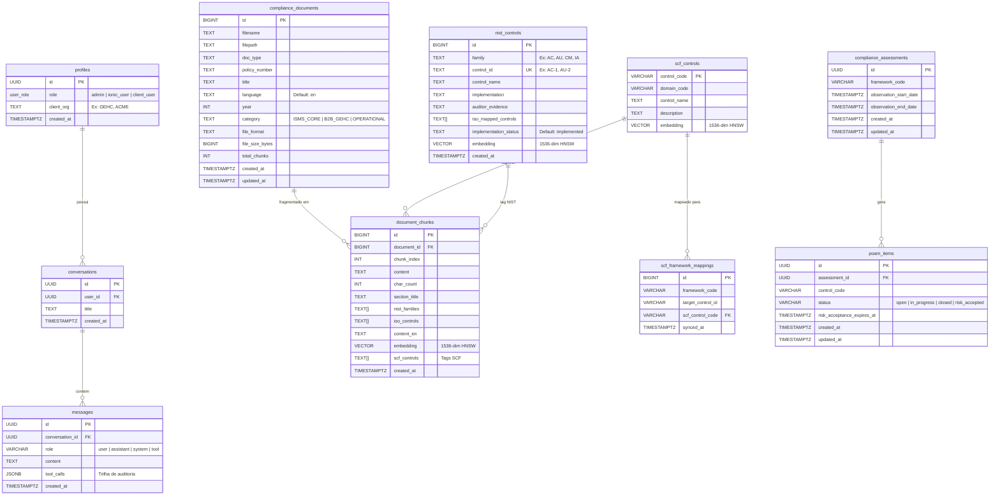

# Documentação do Banco de Dados — Supabase (ihOS)

> **Projeto Supabase:** `uomdcazsriznqytvnsrv`  
> **Região:** AWS  
> **Extensões:** pgvector, uuid-ossp  
> **Última atualização:** 2026-06-04

---

## Visão Geral

| Métrica | Valor |
|:---|---:|
| Total de tabelas | 10 |
| Documentos de compliance | 187 |
| Chunks vetoriais (RAG) | 6.410 |
| Embeddings ativos | 6.410 (100%) |
| Modelo de embedding | `text-embedding-3-small` (1536-dim) |
| Índice vetorial | HNSW (`vector_cosine_ops`) |
| Controles SCF carregados | 0 (bloqueado — API 500) |
| Usuários autenticados | 0 (aguardando setup Next.js) |

---

## Diagrama ER

---

## Schema Detalhado por Tabela

### `profiles`
Criada automaticamente via trigger `on_auth_user_created` quando um usuário faz signup no Supabase Auth.

| Coluna | Tipo | Nullable | Default | Descrição |
|:---|:---|:---|:---|:---|
| `id` | UUID | NOT NULL | — | FK para `auth.users(id)` |
| `role` | user_role | NOT NULL | `client_user` | Enum: `admin`, `ionic_user`, `client_user` |
| `client_org` | TEXT | NULL | — | Organização do cliente B2B (ex: `GEHC`) |
| `created_at` | TIMESTAMPTZ | NULL | `now()` | — |

---

### `conversations`
Conversas do chat. Cada usuário pode ter múltiplas conversas.

| Coluna | Tipo | Nullable | Default | Descrição |
|:---|:---|:---|:---|:---|
| `id` | UUID | NOT NULL | `gen_random_uuid()` | PK |
| `user_id` | UUID | NOT NULL | — | FK para `auth.users(id)` |
| `title` | TEXT | NULL | `New Compliance Chat` | Título da conversa |
| `created_at` | TIMESTAMPTZ | NULL | `now()` | — |

---

### `messages`
Mensagens dentro de conversas. O campo `tool_calls` é a trilha de auditoria do agente.

| Coluna | Tipo | Nullable | Default | Descrição |
|:---|:---|:---|:---|:---|
| `id` | UUID | NOT NULL | `gen_random_uuid()` | PK |
| `conversation_id` | UUID | NOT NULL | — | FK para `conversations(id)` |
| `role` | VARCHAR | NOT NULL | — | `user`, `assistant`, `system`, `tool` |
| `content` | TEXT | NULL | — | Conteúdo da mensagem |
| `tool_calls` | JSONB | NULL | — | Chamadas de ferramentas (audit trail) |
| `created_at` | TIMESTAMPTZ | NULL | `now()` | — |

---

### `compliance_documents`
Documentos de compliance ingeridos pelo ETL pipeline. **187 documentos atualmente.**

| Coluna | Tipo | Nullable | Default | Descrição |
|:---|:---|:---|:---|:---|
| `id` | BIGINT | NOT NULL | `nextval(...)` | PK auto-increment |
| `filename` | TEXT | NOT NULL | — | Nome do arquivo original |
| `filepath` | TEXT | NOT NULL | — | Caminho no filesystem |
| `doc_type` | TEXT | NOT NULL | — | Tipo do documento |
| `policy_number` | TEXT | NULL | — | Número da política (se aplicável) |
| `title` | TEXT | NULL | — | Título extraído |
| `language` | TEXT | NULL | `en` | Idioma do documento |
| `year` | INT | NULL | — | Ano de referência |
| `category` | TEXT | NULL | — | `ISMS_CORE`, `B2B_GEHC`, `OPERATIONAL` |
| `file_format` | TEXT | NULL | — | Extensão (pdf, docx, xlsx) |
| `file_size_bytes` | BIGINT | NULL | — | Tamanho do arquivo |
| `total_chunks` | INT | NULL | `0` | Número de chunks gerados |
| `created_at` | TIMESTAMPTZ | NULL | `now()` | — |
| `updated_at` | TIMESTAMPTZ | NULL | `now()` | — |

**Distribuição por categoria:**

| Categoria | Documentos | Descrição |
|:---|---:|:---|
| `OPERATIONAL` | 146 | Procedimentos operacionais, logs, termos |
| `ISMS_CORE` | 37 | Políticas de segurança centrais (visíveis a todos) |
| `B2B_GEHC` | 4 | Overlay exclusivo GE Healthcare (RLS isolado) |

---

### `document_chunks`
Chunks vetoriais para RAG. **6.410 chunks, 100% com embedding.**

| Coluna | Tipo | Nullable | Default | Descrição |
|:---|:---|:---|:---|:---|
| `id` | BIGINT | NOT NULL | `nextval(...)` | PK auto-increment |
| `document_id` | BIGINT | NULL | — | FK para `compliance_documents(id)` ON DELETE CASCADE |
| `chunk_index` | INT | NOT NULL | — | Posição do chunk no documento |
| `content` | TEXT | NOT NULL | — | Conteúdo original (PT ou EN) |
| `char_count` | INT | NULL | — | Contagem de caracteres |
| `section_title` | TEXT | NULL | — | Título da seção extraída |
| `nist_families` | TEXT[] | NULL | — | Famílias NIST tagueadas (ex: `{AC, AU}`) |
| `iso_controls` | TEXT[] | NULL | — | Controles ISO tagueados |
| `content_en` | TEXT | NULL | — | Tradução para inglês (quando original é PT) |
| `embedding` | VECTOR(1536) | NULL | — | Embedding via `text-embedding-3-small` |
| `scf_controls` | TEXT[] | NULL | — | Tags SCF (0% preenchido — aguardando sync) |
| `created_at` | TIMESTAMPTZ | NULL | `now()` | — |

**Estatísticas:**
- Média de caracteres por chunk: **932**
- Taxa de embedding: **100%** (6.410/6.410)
- Taxa de SCF tagging: **0%** (dependente do sync SCF)

---

### `nist_controls`
Controles NIST 800-53 com implementações documentadas e embedding para busca semântica.

| Coluna | Tipo | Nullable | Default | Descrição |
|:---|:---|:---|:---|:---|
| `id` | BIGINT | NOT NULL | `nextval(...)` | PK |
| `family` | TEXT | NOT NULL | — | Família NIST (AC, AU, CM, etc.) |
| `control_id` | TEXT | NOT NULL | — | ID único (AC-1, AU-2, etc.) |
| `control_name` | TEXT | NOT NULL | — | Nome do controle |
| `implementation` | TEXT | NULL | — | Descrição da implementação |
| `auditor_evidence` | TEXT | NULL | — | Evidência para auditoria |
| `iso_mapped_controls` | TEXT[] | NULL | — | Controles ISO mapeados |
| `implementation_status` | TEXT | NULL | `implemented` | Status de implementação |
| `embedding` | VECTOR(1536) | NULL | — | Embedding para busca semântica |
| `created_at` | TIMESTAMPTZ | NULL | `now()` | — |

---

### `scf_controls`
Catálogo dos 1.468 controles do Secure Controls Framework. **Atualmente vazio** — depende do fix da rota SCF na API do Standard.

| Coluna | Tipo | Nullable | Default | Descrição |
|:---|:---|:---|:---|:---|
| `control_code` | VARCHAR | NOT NULL | — | PK (ex: `DCH-01`, `PRI-03`) |
| `domain_code` | VARCHAR | NOT NULL | — | Domínio do controle (33 domínios) |
| `control_name` | TEXT | NOT NULL | — | Nome do controle |
| `description` | TEXT | NULL | — | Descrição detalhada |
| `embedding` | VECTOR(1536) | NULL | — | Embedding para auto-tagging |

---

### `scf_framework_mappings`
Mapeamentos entre frameworks regulatórios e controles SCF. **Atualmente vazio** — depende do sync.

| Coluna | Tipo | Nullable | Default | Descrição |
|:---|:---|:---|:---|:---|
| `id` | BIGINT | NOT NULL | `nextval(...)` | PK |
| `framework_code` | VARCHAR | NOT NULL | — | Código do framework (ex: `ISO-27001`, `SOC-2`) |
| `target_control_id` | VARCHAR | NOT NULL | — | ID do controle no framework original |
| `scf_control_code` | VARCHAR | NOT NULL | — | FK para `scf_controls(control_code)` |
| `synced_at` | TIMESTAMPTZ | NULL | `now()` | Data da última sincronização |

**Unique constraint:** `(framework_code, target_control_id, scf_control_code)`

---

### `compliance_assessments`
Avaliações de compliance. **Recém-criada, vazia.**

| Coluna | Tipo | Nullable | Default | Descrição |
|:---|:---|:---|:---|:---|
| `id` | UUID | NOT NULL | `gen_random_uuid()` | PK |
| `framework_code` | VARCHAR | NOT NULL | — | Framework da avaliação |
| `observation_start_date` | TIMESTAMPTZ | NULL | — | Início do período de observação |
| `observation_end_date` | TIMESTAMPTZ | NULL | — | Fim do período de observação |
| `created_at` | TIMESTAMPTZ | NULL | `now()` | — |
| `updated_at` | TIMESTAMPTZ | NULL | `now()` | — |

---

### `poam_items`
Planos de ação e marcos (Plan of Action & Milestones). **Recém-criada, vazia.**

| Coluna | Tipo | Nullable | Default | Descrição |
|:---|:---|:---|:---|:---|
| `id` | UUID | NOT NULL | `gen_random_uuid()` | PK |
| `assessment_id` | UUID | NOT NULL | — | FK para `compliance_assessments(id)` |
| `control_code` | VARCHAR | NULL | — | Controle em gap |
| `status` | VARCHAR | NULL | `open` | `open`, `in_progress`, `closed`, `risk_accepted` |
| `risk_acceptance_expires_at` | TIMESTAMPTZ | NULL | — | Data de expiração do aceite de risco |
| `created_at` | TIMESTAMPTZ | NULL | `now()` | — |
| `updated_at` | TIMESTAMPTZ | NULL | `now()` | — |

---

## Índices (14 ativos)

| Tabela | Índice | Tipo |
|:---|:---|:---|
| `compliance_documents` | `compliance_documents_pkey` | btree (PK) |
| `compliance_documents` | `idx_docs_category` | btree |
| `compliance_documents` | `idx_docs_policy` | btree |
| `compliance_documents` | `idx_docs_type` | btree |
| `document_chunks` | `document_chunks_pkey` | btree (PK) |
| `document_chunks` | `idx_chunks_doc` | btree (document_id) |
| `document_chunks` | **`idx_chunks_embedding_hnsw`** | **HNSW** (vector_cosine_ops) |
| `document_chunks` | `idx_chunks_iso` | GIN (iso_controls) |
| `document_chunks` | `idx_chunks_nist` | GIN (nist_families) |
| `document_chunks` | `idx_chunks_scf` | GIN (scf_controls) |
| `nist_controls` | **`idx_nist_controls_embedding_hnsw`** | **HNSW** (vector_cosine_ops) |
| `nist_controls` | `idx_nist_controls_family` | btree |
| `scf_controls` | **`idx_scf_controls_embedding_hnsw`** | **HNSW** (vector_cosine_ops) |
| `scf_framework_mappings` | `idx_scf_mappings_lookup` | btree (framework_code, scf_control_code) |

> **3 índices HNSW ativos** para busca vetorial por similaridade de cosseno em `document_chunks`, `nist_controls` e `scf_controls`.

---

## Políticas RLS (7 ativas)

| Tabela | Comando | Política | Regra |
|:---|:---|:---|:---|
| `compliance_assessments` | SELECT | Admins and Ionic Users can view all | `role IN (admin, ionic_user)` |
| `compliance_documents` | SELECT | Admins and Ionic Users can view all | `role IN (admin, ionic_user)` |
| `compliance_documents` | SELECT | Client users: ISMS_CORE + B2B overlay | `category = ISMS_CORE OR category = B2B_{client_org}` |
| `conversations` | ALL | Users manage own conversations | `user_id = auth.uid()` |
| `document_chunks` | SELECT | Enforce document visibility on chunks | Herda visibilidade do `compliance_documents` pai |
| `messages` | ALL | Users manage messages in own conversations | Via `conversation_id` → `user_id = auth.uid()` |
| `poam_items` | SELECT | Admins and Ionic Users can view all | `role IN (admin, ionic_user)` |

---

## Funções e Triggers

| Tipo | Nome | Descrição |
|:---|:---|:---|
| Trigger | `on_auth_user_created` | Auto-cria `profiles` row com `role = client_user` quando usuário faz signup |
| Cascade | `document_chunks.document_id` | `ON DELETE CASCADE` — deletar documento limpa chunks órfãos (ADR-002) |
